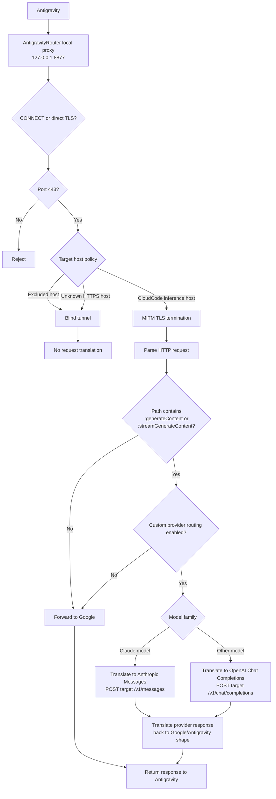
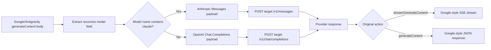
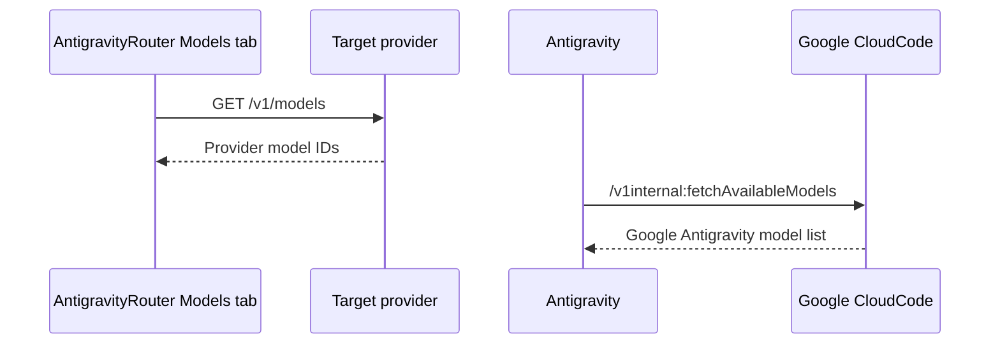

# AntigravityRouter

AntigravityRouter is a macOS menu bar app that routes selected Google Antigravity model traffic through an OpenAI/Anthropic-compatible target provider while leaving non-model traffic on its normal Google path.

The app is intentionally narrow in scope. It is not a general-purpose system-wide interception proxy. It targets the Antigravity CloudCode inference flow, translates supported generation requests, and forwards everything else without provider modification.

## What It Does

- Starts a local proxy listener, by default at `127.0.0.1:8877`.
- Relaunches `/Applications/Antigravity.app` with proxy environment variables and Electron proxy arguments.
- Installs and trusts a local CA named `AntigravityRouter Local CA` so Antigravity can accept the app-generated leaf certificates used for TLS interception.
- Routes supported Antigravity generation requests to the configured target provider when custom provider routing is enabled.
- Forwards supported Antigravity generation requests directly to Google when custom provider routing is disabled.
- Keeps Antigravity model discovery, auth, account, and unrelated Google API requests on the Google/direct path.
- Shows target-provider models in the app UI by calling the configured provider's `/v1/models` endpoint.
- Relaunches Antigravity without proxy settings when you confirm Quit.

Default target provider:

```text
https://cheaprouter.uk
```

Default provider endpoints used by routed requests:

```text
POST /v1/chat/completions
POST /v1/messages
GET  /v1/models
```

## Request Flow



## Routing Rules

AntigravityRouter first decides whether a connection can be handled at all. Then, after TLS is terminated for eligible CloudCode hosts, it decides whether the HTTP request should go to Google or to the configured provider.

### Connection-Level Routing

| Traffic | Behavior |
| --- | --- |
| `cloudcode-pa.googleapis.com:443` | Eligible for MITM. |
| `daily-cloudcode-pa.googleapis.com:443` | Eligible for MITM. |
| `127.0.0.1:443` or `localhost:443` | Eligible for MITM as a local reverse-proxy path. |
| `oauth2.googleapis.com:443` | Blind tunnel. |
| `accounts.google.com:443` | Blind tunnel. |
| `www.googleapis.com:443` | Blind tunnel. |
| `cheaprouter.uk:443` | Blind tunnel; the provider call must not loop back through the proxy. |
| Unknown HTTPS hosts on port `443` | Blind tunnel. |
| Non-`443` CONNECT targets | Rejected. |

For MITM traffic, the proxy presents a leaf certificate generated from the local AntigravityRouter CA. The app only supports intercepted HTTP over TLS with `http/1.1` ALPN. Unsupported ALPN, such as `h2`, fails closed for interceptable requests.

### HTTP-Level Routing

| HTTP request | Custom provider routing disabled | Custom provider routing enabled |
| --- | --- | --- |
| `POST /v1internal:generateContent...` | Forward to Google. | Translate and route to provider. |
| `POST /v1internal:streamGenerateContent...` | Forward to Google. | Translate and route to provider. |
| `POST /v1internal:fetchAvailableModels...` | Forward to Google. | Forward to Google. |
| `:countTokens` requests | Forward to Google or fail closed if translation is attempted. | Not provider-routed. |
| Auth, account, OAuth, general Google API requests | Direct or blind tunnel. | Direct or blind tunnel. |
| Unknown hosts or unrelated HTTPS traffic | Blind tunnel. | Blind tunnel. |

Important: Antigravity's own model discovery is not routed to the target provider. This avoids injecting provider model lists into Antigravity's internal discovery flow.

## Translation Rules



The translator reads the Antigravity request body, extracts the model field recursively, and converts supported Google `contents` payloads into provider-compatible `messages`.

For non-Claude models, the request is translated to an OpenAI Chat Completions payload:

```json
{
  "model": "gpt-5.5",
  "messages": [],
  "stream": true
}
```

For Claude models, the request is translated to an Anthropic Messages payload:

```json
{
  "model": "claude-sonnet-4-6",
  "messages": [],
  "stream": true,
  "max_tokens": 4096
}
```

When present, `generationConfig.temperature` and `generationConfig.maxOutputTokens` are mapped to provider fields.

Unsupported actions or unsupported payload shapes fail closed instead of sending malformed requests upstream.

## Provider Models

The Models tab fetches provider models from:

```text
GET {target-provider-base-url}/v1/models
```

The parser accepts common OpenAI-style and Anthropic-style model containers, including IDs under `data`, `models`, `openai`, `anthropic`, or `claude`.

This provider-model fetch is only for the AntigravityRouter UI. It does not replace or proxy Antigravity's internal `fetchAvailableModels` request.



## Setup

1. Install and open `AntigravityRouter`.
2. In Settings, enter the target provider base URL and API key.
3. Click `Install CA` and approve trust installation for `AntigravityRouter Local CA`.
4. Keep `Local proxy listener` enabled.
5. Click `Relaunch Antigravity`.
6. Use `Enable Custom Provider Routing` only when you want supported generation requests to be translated and sent to the configured provider.

When custom provider routing is disabled, AntigravityRouter still allows the local proxy flow, but supported model requests are forwarded to Google's CloudCode endpoint instead of the target provider.

The Status tab reports `MITM` as `On` or `Off`. It also probes the configured provider base URL so the provider row moves from `checking` to `reachable` or `unreachable` instead of staying indefinitely unchecked.

## Security And Privacy Notes

- The provider API key is stored in the macOS Keychain.
- Current settings are persisted in user defaults.
- CA material is stored through the app's keychain-backed CA store, with migration support for legacy file-backed material.
- Raw HTTP logging is local. Redacted raw logging is enabled by default.
- Unsafe full-body logging can store prompts, responses, and sensitive headers. It is disabled on each new app launch.
- The Log tab supports truncation and a configurable tail-line limit.

Do not enable unsafe full-body logging unless you need exact request and response bytes for debugging.

## Build And Test

```bash
swift test
swift build -c release --product AntigravityRouter
swift build -c release --product AntigravityPorterMonitor
```

The package requires macOS 14 or newer and Swift 6.

## Troubleshooting

### Antigravity does not hit the target provider

- Confirm `Local proxy listener` is enabled.
- Click `Relaunch Antigravity` so Antigravity starts with the proxy environment and Electron proxy arguments.
- Confirm `Enable Custom Provider Routing` is active.
- Confirm the request path is `:generateContent` or `:streamGenerateContent`.
- Confirm the provider API key is saved.
- Check the Log tab for `Google direct`, `cheaprouter`, `blind tunnel`, or `fail-closed` entries.

### Antigravity shows no models

Antigravity's internal model discovery should remain Google-direct. Provider model fetching in the AntigravityRouter Models tab is separate and does not populate Antigravity's internal model picker.

### TLS or certificate errors

- Run `Install CA` again from Settings.
- Relaunch Antigravity after the CA is trusted.
- If Antigravity was already running before trust was installed, quit and relaunch it through AntigravityRouter.

### Provider request fails

- Confirm the provider base URL uses `https`.
- Confirm the API key is valid for the target provider.
- Confirm the provider supports the selected route:
  - Claude models require `/v1/messages`.
  - Non-Claude models require `/v1/chat/completions`.

### Logs are too large

Use `Truncate` in the Log tab and reduce `Tail log lines` in Settings.

### Quit behavior

Clicking `Quit` asks for confirmation. Confirming relaunches Antigravity without proxy-related environment variables, stops the local proxy after the relaunch succeeds, and then exits AntigravityRouter.
